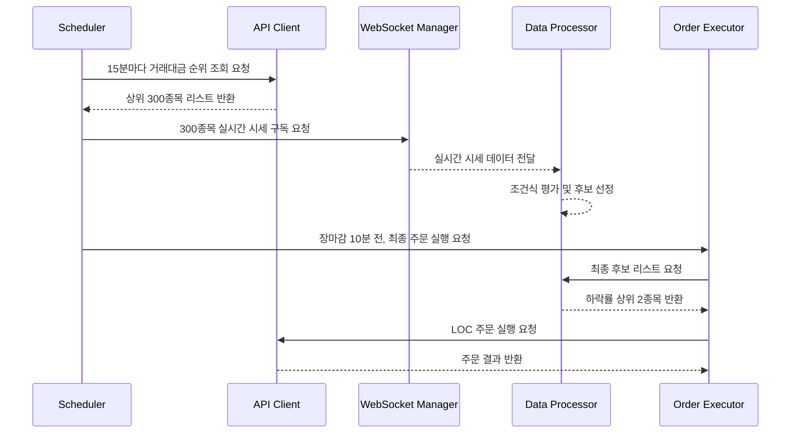

# TRD (Technical Requirements Document) v2.0

**프로젝트명**: 한국투자증권 API 기반 미국주식 거래대금 상위 300종목 자동 스크리닝 및 종가 자동매매 시스템

**버전**: 2.0
**작성일**: 2025년 11월 10일
**기준 PRD**: v3.0
**개발 언어**: C# (.NET 8)
**UI 프레임워크**: WPF (MVVM 패턴)
**실행 환경**: Windows Server 2019+ (VPS)

---

## 1. 시스템 아키텍처

### 1.1. 개요

본 시스템은 **.NET Worker Service**를 기반으로 하는 백그라운드 애플리케이션으로 설계하여 VPS 환경에서 24시간 안정적인 구동을 보장한다. UI는 WPF를 사용하여 시스템의 상태를 모니터링하고 설정을 변경하는 데 사용된다.

### 1.2. 주요 컴포넌트

| 컴포넌트 | 설명 | 구현 기술 |
|---|---|---|
| **Scheduler** | 주기적인 작업을 스케줄링 (예: 거래대금 순위 15분마다 조회) | `System.Threading.Timer` 또는 Quartz.NET |
| **API Client** | 한국투자증권 REST API 호출 담당 (인증, Throttling, 재시도 포함) | `HttpClient`, `Polly` (재시도 라이브러리) |
| **WebSocket Manager** | 8개의 WebSocket 세션을 관리하여 300종목 실시간 시세 수신 | `ClientWebSocket` |
| **Data Processor** | 수신된 실시간 데이터를 파싱하고 조건식 평가 | `System.Text.Json` 또는 `Newtonsoft.Json` |
| **Order Executor** | 최종 선정된 종목에 대해 LOC 주문 실행 | `API Client` |
| **Logger** | 시스템의 모든 활동을 파일로 기록 | `Serilog` 또는 `NLog` |
| **UI (WPF)** | 시스템 상태 모니터링 및 설정 변경 | WPF, MVVM 패턴 (`CommunityToolkit.Mvvm`) |

### 1.3. 데이터 흐름

---

## 2. API 기술 명세

### 2.1. REST API

| API | TR ID | Method | URL | 주요 파라미터 | 비고 |
|---|---|---|---|---|---|
| **인증 (토큰 발급)** | - | POST | `/oauth2/token/P` | `grant_type`, `appkey`, `appsecret` | 1시간마다 갱신 필요 |
| **인증 (접속키 발급)** | - | POST | `/oauth2/Approval` | `grant_type`, `appkey`, `secretkey` | WebSocket 연결 전 발급 |
| **거래대금 순위** | **HHDFS76320010** | GET | `/uapi/overseas-stock/v1/ranking/trade-pbmn` | `EXCD` (NYS, NAS) | **모의투자 미지원** |
| **주문 (LOC)** | **TTTT1002U** | POST | `/uapi/overseas-stock/v1/trading/order` | `ORD_DVSN`="32" | 현재가 +5%로 주문가 설정 |
| **일/주/월봉 조회** | **HHDFS76240000** | GET | `/uapi/overseas-stock/v1/quotations/dailyprice` | `GUBN` (D, W, M) | 조건식 평가용 데이터 조회 |

### 2.2. WebSocket API

| API | TR ID | 설명 | 구독 방식 |
|---|---|---|---|
| **해외주식 실시간체결가** | **HDFSCNT0** | 실시간 현재가, 등락률, 거래량 등 수신 | 300종목 / 8개 세션으로 분산 구독 |

### 2.3. API 호출 제한 및 안정성

- **Throttling**: 모든 REST API 호출은 **Throttling Queue**를 통해 관리한다. (최소 50ms 간격, 초당 20회 미만)
- **재시도**: `Polly` 라이브러리를 사용하여 API 호출 실패 시 **지수 백오프(Exponential Backoff)** 방식으로 자동 재시도한다. (최대 3회)
- **WebSocket 재연결**: WebSocket 연결이 비정상적으로 종료될 경우, 10초 후 자동 재연결을 시도한다.

---

## 3. 데이터베이스 및 로깅

### 3.1. 데이터베이스

- 별도의 데이터베이스를 사용하지 않고, 필요한 데이터(설정, 종목 정보 등)는 **JSON 파일** 형태로 로컬에 저장하고 관리한다.

### 3.2. 로깅

- **라이브러리**: `Serilog` 사용
- **로그 레벨**: `Verbose`, `Debug`, `Information`, `Warning`, `Error`, `Fatal`
- **로그 형식**: `[{Timestamp:HH:mm:ss} {Level:u3}] {Message:lj}{NewLine}{Exception}`
- **저장 방식**: 로그 파일을 날짜별로 자동 생성 (`logs/log-20251110.txt`)하며, 30일이 지난 로그 파일은 자동으로 삭제한다.

---

## 4. 핵심 로직 상세 설계

### 4.1. 거래대금 상위 300종목 스크리닝

1.  `Scheduler`가 15분마다 `GetTop300Stocks` 메서드를 호출한다.
2.  `API Client`를 통해 KIS API를 호출하여 뉴욕(150개), 나스닥(150개) 거래대금 순위를 각각 조회한다.
3.  두 리스트를 합치고, 중복을 제거하여 최종 300종목 리스트를 생성한다.
4.  이전 리스트와 비교하여 변경된 종목이 있다면, `WebSocket Manager`에 변경 사항을 알려 구독 종목을 업데이트한다.

### 4.2. 실시간 조건 평가

1.  `WebSocket Manager`는 수신된 실시간 체결가 데이터를 `DataReceived` 이벤트를 통해 `Data Processor`에 전달한다.
2.  `Data Processor`는 사전에 조회해 둔 일봉/주봉 데이터와 실시간 현재가를 결합한다.
3.  사용자가 설정한 3개의 조건식을 평가하여 `(A AND B) OR C`와 같은 최종 결과를 계산한다.
4.  결과가 `True`인 종목은 `CandidateStocks` 리스트에 추가/갱신한다.

### 4.3. 최종 매수 결정 및 주문 (장마감 10분 전)

1.  `Scheduler`가 장마감 10분 전에 `ExecuteFinalOrders` 메서드를 호출한다.
2.  `Order Executor`는 `CandidateStocks` 리스트에서 **2회 연속(10초 간격) True** 상태를 유지한 종목만 필터링하여 최종 후보를 확정한다.
3.  최종 후보들을 **하락률 순으로 정렬**하고, 상위 2개 종목을 선정한다.
4.  선정된 종목에 대해 **총 자산, 매수 비율, 종목 수(1 or 2)**를 고려하여 주문 수량을 계산한다.
5.  `API Client`를 통해 **현재가의 +5% 가격**으로 **LOC(`ORD_DVSN`="32") 주문**을 실행한다.
6.  주문 실행 결과를 `Logger`에 기록한다.

---

## 5. UI (WPF) 설계

- **패턴**: MVVM (Model-View-ViewModel) 패턴을 적용한다.
- **라이브러리**: `CommunityToolkit.Mvvm`을 사용하여 `ObservableObject`, `RelayCommand` 등을 구현한다.
- **데이터 바인딩**: View와 ViewModel 간의 모든 데이터는 데이터 바인딩으로 연결한다.
- **스레드 안전성**: 백그라운드 스레드에서 발생한 데이터 변경 사항은 `Dispatcher.Invoke`를 사용하여 UI 스레드에서 안전하게 업데이트한다.

### ViewModel 구조

- `MainViewModel`: 전체 애플리케이션의 상태 관리
- `SettingsViewModel`: 매수 비율, 조건식 등 설정 관리
- `DashboardViewModel`: 계좌 정보, 시장 상태 등 대시보드 데이터 관리
- `LogViewModel`: 실시간 로그 데이터 관리

---

## 6. 개발 환경 및 종속성

- **.NET**: .NET 8
- **IDE**: Visual Studio 2022
- **주요 NuGet 패키지**:
  - `Microsoft.Extensions.Hosting`: Worker Service 구현
  - `CommunityToolkit.Mvvm`: MVVM 패턴 지원
  - `Serilog`: 로깅
  - `Newtonsoft.Json`: JSON 직렬화/역직렬화
  - `Polly`: API 재시도 정책 구현

---

## 7. 테스트 전략

- **단위 테스트**: 각 컴포넌트(API Client, Data Processor 등)의 핵심 로직을 테스트한다. (`xUnit` 또는 `MSTest`)
- **통합 테스트**:
  - **1단계 (모의투자)**: 모의투자 계좌를 사용하여 주문/잔고 API 연동을 테스트한다. (거래대금 순위 API는 Mock 데이터 사용)
  - **2단계 (실전-조회)**: 실전 계좌를 사용하여 거래대금 순위 조회 및 실시간 시세 수신을 테스트한다.
  - **3단계 (실전-소액주문)**: 실전 계좌에서 소액으로 실제 LOC 주문이 정상적으로 실행되는지 최종 테스트한다.

---

## 8. 참고 자료

- **한국투자증권 API 문서**: https://apiportal.koreainvestment.com/apiservice
- **PRD v3.0**: `/home/ubuntu/research/prd_v3.0.md`
- **API 상세 명세**: 
  - `/home/ubuntu/research/kis_overseas_stock_trade_volume_api.md`
  - `/home/ubuntu/research/kis_overseas_stock_order_api.md`
  - `/home/ubuntu/research/kis_overseas_stock_websocket_api.md`
